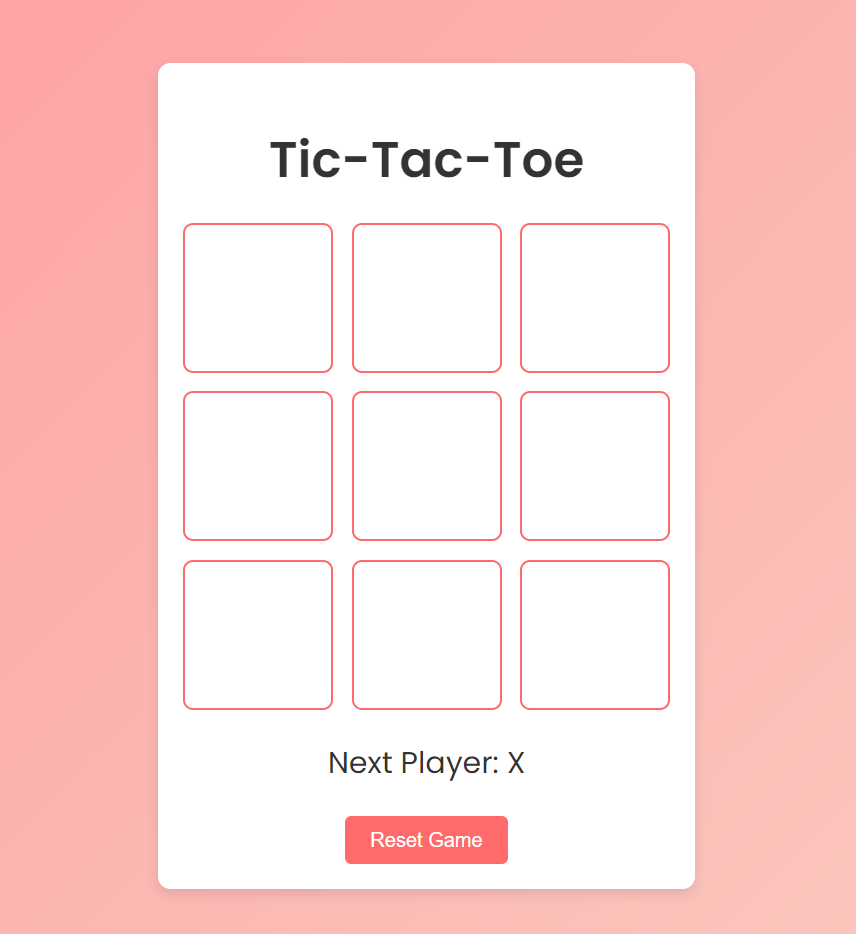
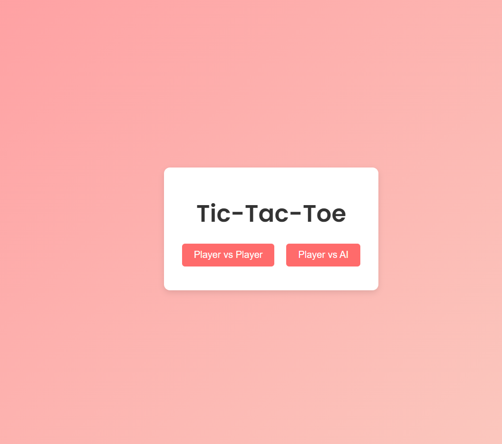

# Tic-Tac-Toe Game 🎮

Welcome to the **Tic-Tac-Toe (XO) Game**! This project is a modern take on the classic game built using **React** and **Vite**. You can play against another player (PvP) or challenge the AI, which uses the Minimax algorithm for strategic gameplay.

## 🚀 Features

- **Player vs Player (PvP)**: Play with a friend locally.
- **Player vs AI**: Challenge a computer opponent using a smart AI that learns and blocks your moves.
- **Minimax Algorithm**: The AI uses the Minimax algorithm to make the best possible moves.
- **Responsive Design**: Fully responsive game board for both mobile and desktop devices.
- **Confetti Celebration**: Celebrate wins with a confetti animation!
- **Game Reset**: Easily reset the game to start fresh.

## 🛠️ Technologies Used

- **React**: For building the interactive user interface.
- **Vite**: For fast and optimized development and build process.
- **JavaScript**: Game logic and Minimax AI algorithm.
- **CSS**: Styling and layout for the game.
- **canvas-confetti**: For fun victory animations.

## 🎮 How to Play

1. Clone the repository:

   ```bash
   git clone https://github.com/Obaisamman/XO-Game.git
   ```

2. Navigate to the project folder:

   ```bash
   cd XO-Game
   ```

3. Install the required dependencies:

   ```bash
   npm install
   ```

4. Start the game locally:

   ```bash
   npm run dev
   ```

5. Open your browser and go to `http://localhost:5173` to start playing!

## 🤖 AI Logic

The AI uses the **Minimax algorithm**, which simulates all possible moves to determine the best one. The AI tries to win or block the player from winning in the next move, making it a tough opponent.

## 🖼️ Screenshots


### Main Game Screen


## 🚀 Future Features

- Improve UI design and animations.
- Add difficulty levels for AI (Easy, Medium, Hard).

## 👨‍💻 Contributing

Feel free to contribute by forking the project, submitting a pull request, or suggesting features and improvements in the issues section.


## 🧑‍💻 Author

- **Obai Alsamman** - [LinkedIn Profile](https://www.linkedin.com/in/obaisamman) - [GitHub](https://github.com/Obaisamman)

